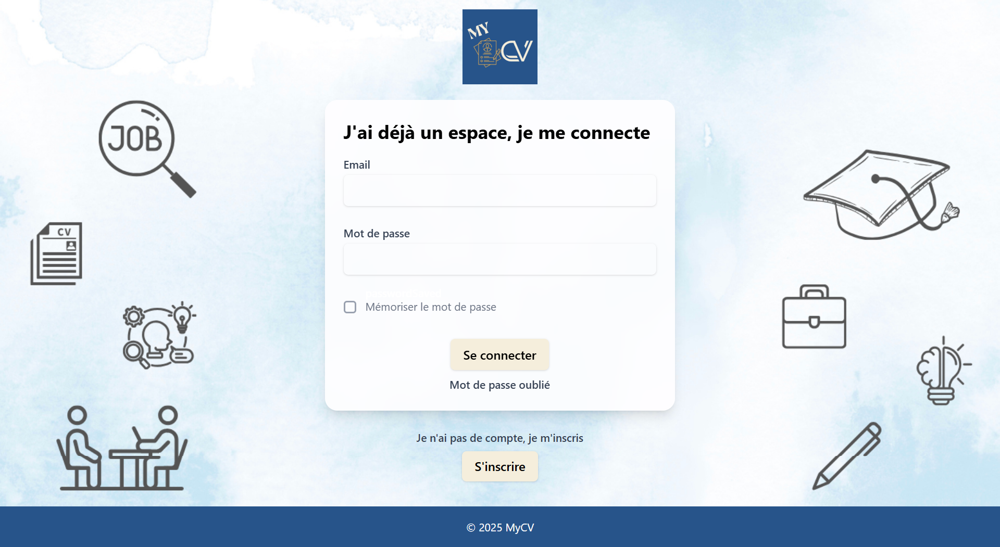
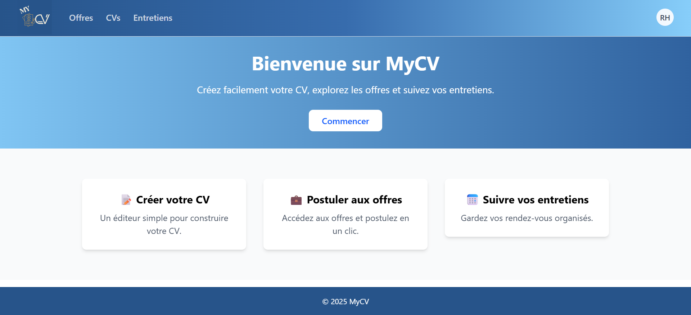
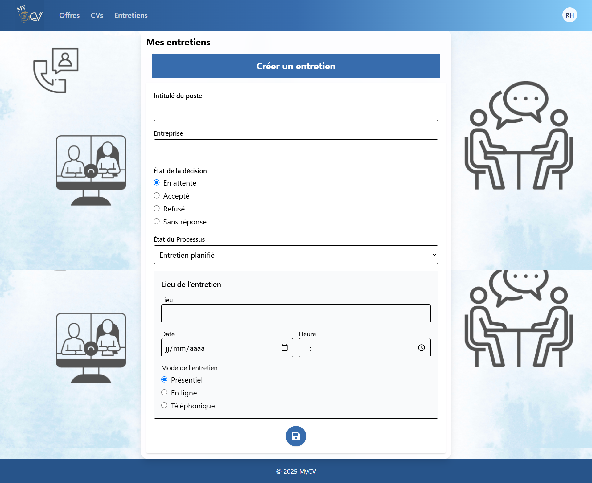

# MyCV - Frontend

A modern CV Management web application built with React and TypeScript.

## Technologies

- React
- TypeScript
- Vite
- Material UI
- React Router
- Axios

## Features

- User authentication
- CV management
- Job offers
- Interview management
- Responsive design

## Screenshots

### Login



### Home



### CV Management


### Interview Management



## Installation

```bash
npm install
npm run dev
```